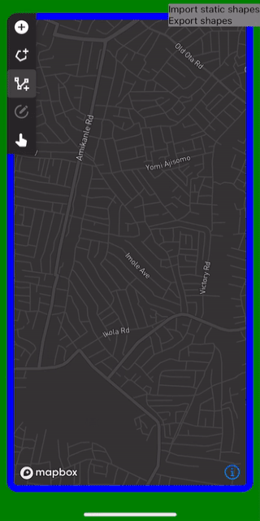
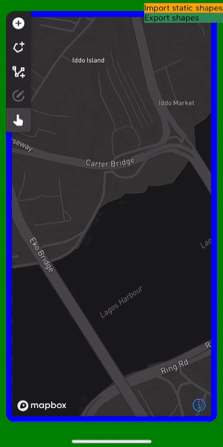

<!-- omit in toc -->
# react-native-mapbox-geometry-editor

Interactive shape editing on top of the Mapbox Maps SDK for React Native

<!-- omit in toc -->
## Table of Contents
- [Example](#example)
- [Features](#features)
  - [Limitations](#limitations)
- [Installation](#installation)
  - [Import options](#import-options)
    - [Importing library builds (recommended)](#importing-library-builds-recommended)
    - [Import library source (not recommended)](#import-library-source-not-recommended)
- [Usage](#usage)
  - [Geometry format and metadata](#geometry-format-and-metadata)
    - [Advanced usage](#advanced-usage)
- [API Documentation](#api-documentation)
- [Known issues and future work](#known-issues-and-future-work)
  - [Dependency updates](#dependency-updates)
  - [Custom user interface](#custom-user-interface)
  - [Packaging and publishing](#packaging-and-publishing)
  - [Minor general issues](#minor-general-issues)
  - [Android-specific issues](#android-specific-issues)
  - [iOS-specific issues](#ios-specific-issues)
- [Contributing](#contributing)
- [License](#license)

## Example

The example app demonstrates almost all of the features of the library, in particular geometry drawing, and creating custom forms for editing metadata associated with geometry.

<p float="left">
  
  
</p>

To run the example app, refer to the instructions in [CONTRIBUTING.md](CONTRIBUTING.md).

## Features

- Create, edit, and delete different types of [GeoJSON](https://tools.ietf.org/html/rfc7946) geometry: `Point`, `LineString`, and `Polygon`
- Select single or multiple shapes for deletion
- Select single shapes and preview, view, or edit their metadata. Metadata is stored in GeoJSON `"properties"`.
- Create custom forms for editing metadata
- Customize the content that appears in metadata previews
- Undo and redo shape editing and deletion changes
- Import GeoJSON into the library for display or editing
- Export GeoJSON from the library for use in the rest of your application

### Limitations

During geometry import operations (see [`src/util/geometry/io.tsx`](./src/util/geometry/io.tsx)):

- Multi-geometry [GeoJSON](https://tools.ietf.org/html/rfc7946) types will be split up.
  For example, `MultiLineString` features will be divided into `LineString` features.
- Holes will be removed from polygons.

## Installation

```sh
yarn add react-native-mapbox-geometry-editor @react-native-mapbox-gl/maps react-native-get-random-values
```

If you wish to use the default editing controls user interface (`<GeometryEditorUI/>`) from this library, then you must also install the peer dependency `react-native-vector-icons`.
Run `yarn add react-native-vector-icons`, and then follow the additional instructions listed [here](https://github.com/oblador/react-native-vector-icons#installation).
Note that there is no need to set up FontAwesome 5 support with `react-native-vector-icons`.

The unofficial Mapbox Maps SDK for React Native, `@react-native-mapbox-gl/maps` is a peer dependency.
To use it, you must have a [Mapbox API access token](https://docs.mapbox.com/help/how-mapbox-works/access-tokens/), unless you plan to use a different map provider.
See [below](#dependency-updates) for more remarks concerning the Mapbox dependency.

### Import options

#### Importing library builds (recommended)

The library provides builds to suit different transpilation mechanisms:

```js
// commonjs module system
import { GeometryEditorUI } from 'react-native-mapbox-geometry-editor/lib/commonjs';

// ES6 module system
// Useful for tree-shaking
import { GeometryEditorUI } from 'react-native-mapbox-geometry-editor/lib/module';

// TypeScript
import { GeometryEditorUI } from 'react-native-mapbox-geometry-editor/lib/typescript';
```

For more information about the build targets, see https://github.com/callstack/react-native-builder-bob#targets

#### Import library source (not recommended)

```js
import { GeometryEditorUI } from 'react-native-mapbox-geometry-editor';
```

The plain import will import the source code of the library, meaning that your code will need to be transpiled under Babel or TypeScript configurations that are compatible with those used to develop the library.

## Usage

Presently, the example app ([`example/src/App.tsx`](./example/src/App.tsx)) showcases almost all of the features of the library, and is the best, and most concise, source of documentation.
The library also has [Typedoc documentation](#api-documentation).

You can run the example by following the instructions in [CONTRIBUTING.md](CONTRIBUTING.md).

### Geometry format and metadata

The library uses the [GeoJSON Feature](https://tools.ietf.org/html/rfc7946) format to communicate geometry with client applications.
GeoJSON Feature objects can be associated with arbitrary metadata, stored under a `"properties"` key.

The `<GeometryEditorUI/>` graphical interface for the library accepts schema descriptions.
The library uses schema descriptions build forms so that the user can edit geometry metadata in a type-safe manner.
The schema descriptions are generated by the functions passed in the `metadataSchemaGeneratorMap` prop of `<GeometryEditorUI/>`.

Note that schema descriptions are requested immediately before an interface is opened for viewing or editing metadata, so different schema descriptions can be returned at different times, and can be customized for different GeoJSON Feature objects.
If a schema description returned by a function is not `null`, it must be an object of the form parsed by [`@demvsystems/yup-ast`](https://github.com/demvsystems/yup-ast), subject to restrictions described below.

The schema description must contain a top-level object:
```TypeScript
[
  ['yup.object'],
  ['yup.required'],
  [
    'yup.shape',
    {
      // FIELDS
      fieldKey: [...] // FIELD SCHEMA
    },
  ],
]
```

The `FIELDS` portion contains the actual fields of the GeoJSON metadata.
The datatype of a field must be one of the following:
- `fieldKey: [['yup.mixed'], ['yup.oneOf', ["ARRAY", "OF", "STRINGS" ]],]`: A string-typed enumeration, where the array of possible values must have at least one element
- `fieldKey: [['yup.string']]`: A string
- `fieldKey: [['yup.number']]`: A number
- `fieldKey: [['yup.boolean']]`: A boolean

Fields with datatypes not in the above list will not appear in metadata forms, but can still be present in the metadata of objects imported by the library.
The library will only display and allow editing of fields of the supported types, and will leave other fields hidden and untouched.
The library will also ignore all properties of metadata objects that are not described in the schema.

The schema description can (and should) contain human-readable text to assist the user:
- Fields can be given human-readable names using the `'yup.label'` attribute.
  For example, `fieldKey: [['yup.boolean'], ['yup.label', 'Field name'],]` gives the field a name of `'Field name'`.
  If a label is not provided, the field name will default to the field's key.
- Constraints on fields beyond basic datatype constraints can be associated with custom error messages.
  For example, if a field's schema is `fieldKey: [['yup.string'], ['yup.required', 'This field is required'],]`, then if the user does not give the field a value, they will be shown the error message `'This field is required'`.

Refer to [the example app](./example/src/App.tsx) for an example of a complex metadata schema description.

The library provides the `validateMetadata()` utility function for validating the syntax of schema descriptions.
`validateMetadata()` can also test whether a given JavaScript object conforms to the input schema description.

#### Advanced usage

Metadata schema descriptions can be given meta information at both the object and field level:

```TypeScript
[
  ['yup.object'],
  ['yup.required'],
  ['yup.meta', {...}], // Object-level meta information
  [
    'yup.shape',
    {
      fieldKey: [..., ['yup.meta', {...}], ...] // Field schema with field-level meta information
    },
  ],
]
```

Meta information controls the circumstances under which metadata objects and metadata object fields can be viewed and edited, for instance.

Object-level meta information is described by the `MetadataAttributes` interface in `src/type/metadata.ts`, whereas field-level meta information is described by the `FieldAttributes` interface in `src/type/metadata.ts`.
Please read the code documentation comments of these interfaces for descriptions of the available options.
Default values for meta information are provided by the `metadataAttributesImpl` and `fieldAttributesImpl` validators in `src/util/metadata/schema.ts`, so the client application only needs to provide any meta information properties whose values must differ from the defaults.

## API Documentation

HTML API documentation for the library can be generated using Typedoc as follows:

1. Run `yarn bootstrap` in the root directory of the repository
2. Run `yarn docs`
3. Open `docs/src/index.html` in a web browser

## Known issues and future work

### Dependency updates

The library and its example app need to be updated to the latest versions of their dependencies, in particular:
- [React Native](https://reactnative.dev/)
- [react-native-paper](https://github.com/callstack/react-native-paper)
- [Mapbox Maps SDK for React Native](https://github.com/rnmapbox/maps)

The Mapbox Maps SDK now supports multiple different map library implementations, and the documentation of this library should be updated to describe how to take advantage of the different map libraries.
Presently, this library's example uses MapLibre on Android, and a version of Mapbox prior to v10 on iOS.
Other map libraries should work, but need to be tested.
On both platforms, the example app is configured to use Mapbox's services as its map provider, but the library could be used with other map servers supported by the Mapbox Maps SDK for React Native.

### Custom user interface

The `<GeometryEditorUI/>` component renders a graphical user interface for editing geometry on top of a map.
(It also renders the map.)
The user interface is not customizable aside from some coarse style settings.

The library also exposes a `<GeometryEditor/>` component that renders a map, but no geometry editing controls.
As a result, this component can only be used to display geometry.

In the future, either `<GeometryEditorUI/>` should accept more user interface customization options, or `<GeometryEditor/>` should expose a full programmatic interface for editing geometry.
Otherwise, it will continue to be difficult to adapt geometry editing controls to the look and feel of the surrounding app.

### Packaging and publishing

In the future, this library should be published to a package repository, such as NPM, for easier use with package managers.

### Minor general issues
- In some client applications, while running in development mode, the library will emit the following warning:
  `"[mobx] Derivation observer_StoreProvider is created/updated without reading any observable value"`
  Refer to the comments in `src/state/StoreProvider.tsx` for details.
- There are inconsistent performance issues with React Native Paper-based dialogs.
  Presently these issues seem to be observed only on iOS, and only with dialogs
  that need to manage some local state.
  A possibly related issue may be https://github.com/callstack/react-native-paper/issues/2157
- Enumeration and boolean-typed geometry metadata fields are always given values during metadata creation or editing operations, even if the client application marks the fields as `'yup.optional'` (optional) fields, or marks the fields as non-creatable or non-editable.
  This is not necessarily a problem, since these fields will therefore always be given valid values.
  The library is still able to handle enumeration and boolean-typed fields that have missing or invalid values, however, such as when rendering metadata created outside the library.

### Android-specific issues
- Geometry rendering on an Android emulator may exhibit visual problems such as rendering points in grey instead of in their desired colours.
  Zooming in and out on the map may make colours randomly appear and disappear.
- Draggable points/vertices will usually render underneath all other geometry
  (https://github.com/react-native-mapbox-gl/maps/issues/806).

### iOS-specific issues
- To drag an editable point, it may be necessary to first tap on the point (press and release) before pressing and holding to drag the point.
- Editable points may snap back to their original positions while or after being dragged (https://github.com/react-native-mapbox-gl/maps/issues/1117).
- To draw a new point, it may be necessary to first tap on the map, to switch focus to the map, after having tapped on a geometry object or on a user interface element.
  In other words, two taps on the map may be required to draw a new point.

## Contributing

See the [contributing guide](CONTRIBUTING.md) to learn how to run the example app, and how to contribute to the repository.

## License

MIT
